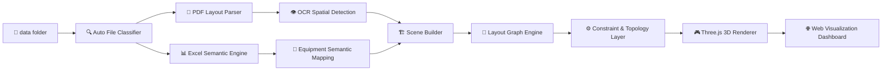
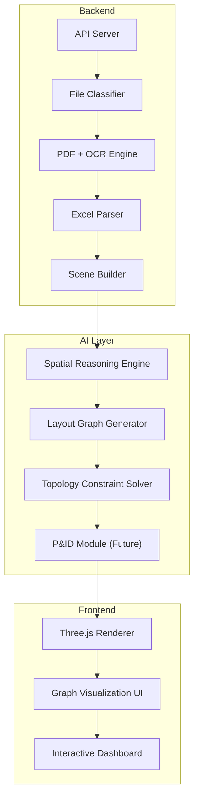

# 🌐 Industrial Digital Twin System / Système de Jumeau Numérique Industriel  
# 工业数字孪生系统

---

## 📌 One-line Overview / Résumé en une phrase / 一句话概览

🇨🇳 将工业二维图纸（PDF/PNG）与 Excel 设备数据自动转换为可交互 3D 工业数字孪生系统。  
🇫🇷 Transformation automatique des plans industriels 2D (PDF/PNG) et des données Excel en système 3D interactif de jumeau numérique industriel.

---

## 🧭 System Pipeline / Pipeline système / 工业数据流（Mermaid）



---

## 🏗 System Architecture / Architecture système / 系统架构（Mermaid）



---

## 📡 API Overview / Vue API / 接口总览

```text
┌────────────────────────────────────┐
│ GET /api/pipeline                  │
├────────────────────────────────────┤
│ Full digital twin output           │
│ Scene + Graph + Constraints        │
└────────────────────────────────────┘
```

```text
┌────────────────────────────────────┐
│ GET /api/layout_graph              │
├────────────────────────────────────┤
│ Semantic graph (nodes/edges/zones)│
└────────────────────────────────────┘
```

```text
┌────────────────────────────────────┐
│ POST /api/upload                   │
├────────────────────────────────────┤
│ Upload PDF/Excel → Auto pipeline   │
└────────────────────────────────────┘
```

---

## ✅ Current System Features / Fonctionnalités actuelles / 当前系统能力

### 1️⃣ Smart File Classification / Classification intelligente des fichiers / 智能文件识别

🇨🇳 用户只需将文件放入 `data/`，系统自动识别 `layout / excel / reference / gad / structure`。  
🇫🇷 Il suffit de déposer les fichiers dans `data/`, le système identifie automatiquement `layout / excel / reference / gad / structure`.

- ✔ 无需改名 / sans renommage
- ✔ 支持中英法命名 / noms chinois-anglais-français supportés
- ✔ 自动分类 / classification automatique

### 2️⃣ PDF Parsing Engine / Moteur d’analyse PDF / PDF 图纸解析

🇨🇳 支持 PDF 转图像、多页拆分、首页布局选择、runtime 缓存。  
🇫🇷 Conversion PDF→image, découpage multi-pages, sélection de la première page comme layout, cache runtime.

### 3️⃣ OCR Positioning / Positionnement OCR / OCR 设备定位

🇨🇳 自动识别设备 Tag（如 B200/E100/P001A），输出 `position / confidence / source`。  
🇫🇷 Détection automatique des tags équipement (B200/E100/P001A) avec sortie `position / confidence / source`.

### 4️⃣ Excel Semantic Fusion / Fusion sémantique Excel / Excel 语义融合

🇨🇳 解析 `tag/service/diameter/length/height/position`，用于属性绑定与工艺语义。  
🇫🇷 Analyse `tag/service/diameter/length/height/position` pour liaison d’attributs et sémantique de procédé.

### 5️⃣ Layout Graph Core / Noyau Layout Graph / Layout Graph 核心

🇨🇳 系统输出结构化工业语义图：  
🇫🇷 Le système produit un graphe sémantique industriel structuré :

```json
{
  "nodes": [],
  "edges": [],
  "zones": [],
  "constraints": [],
  "walls": {}
}
```

---

## 📁 Data Folder Policy / Politique du dossier data / 数据目录规则

🇨🇳 用户可自由命名并放入：PDF/PNG/JPG/JPEG/XLSX。  
🇫🇷 Les fichiers peuvent être nommés librement : PDF/PNG/JPG/JPEG/XLSX.

支持类型 / Types pris en charge:
- layout（布局图）
- excel（设备表）
- reference（参考资料）
- gad（标准图）
- structure（结构图）

系统会自动分类并写入 `data/runtime/` 缓存。  
Le système classe automatiquement et écrit le cache dans `data/runtime/`.

---

## 🚀 Quick Start (Windows) / Démarrage rapide (Windows) / Windows 快速启动

### 1) Install dependencies / Installer les dépendances / 安装依赖

```bash
pip install -r requirements.txt
```

### 2) Start demo (recommended) / Démarrer la démo (recommandé) / 启动演示（推荐）

```bash
python run.py
```

Or double click / Ou double-cliquer / 或双击：

```text
start_demo.bat
```

### 3) Open browser / Ouvrir le navigateur / 打开浏览器

- `http://localhost:3000`

### Upload categories (demo UX) / Catégories d’upload (UX démo) / 上传分类说明

- **Required / Requis / 必填**
  - `layout` (PDF/PNG/JPG/JPEG): floor/layout drawing used by OCR + wall parsing
  - `excel` (XLSX): equipment attributes table
- **Optional / Optionnel / 可选**
  - `reference` (PDF): additional technical docs, consumed by Phase C P&ID linking
  - `structure` (PDF/PNG/JPG/JPEG): reserved for structure-specific parsing extensions
- **Developer-only (hidden in UI) / Développeur seulement (masqué UI) / 开发项（前端隐藏）**
  - `gad` (PDF): currently used only by backend classifier/P&ID helper, not required for demo path

### Manual fallback / Démarrage manuel / 手动启动方式

```bash
python -m backend.api
cd frontend
python -m http.server 3000
```

---

## 🧭 End-to-End Flow / Flux bout-en-bout / 全链路流程

1. 🇨🇳 把文件放进 `data/`（任意命名）  
   🇫🇷 Déposer les fichiers dans `data/` (nommage libre)
2. 🇨🇳 启动后端与前端  
   🇫🇷 Démarrer backend et frontend
3. 🇨🇳 打开网页并点击「加载项目」  
   🇫🇷 Ouvrir la page et cliquer « Charger le projet »
4. 🇨🇳 系统自动执行：文件识别→PDF转图→OCR定位→Excel融合→墙体解析→关系计算→Graph生成→Three.js更新  
   🇫🇷 Exécution automatique : classification→PDF→OCR→fusion Excel→murs→relations→graphe→rendu Three.js

---

## 🌐 API Overview / Vue d’ensemble API / API接口总览

### 基础接口 / API de base / Basic APIs

- `GET /api/files` — 🇨🇳 当前识别文件 / 🇫🇷 fichiers classifiés
- `GET /api/status` — 🇨🇳 完整性状态 / 🇫🇷 état de complétude
- `POST /api/upload` — 🇨🇳 上传并重算 / 🇫🇷 upload + recalcul
- `GET /api/task/<task_id>` — 🇨🇳 后台任务状态 / 🇫🇷 statut de tâche asynchrone
- `GET /api/task/latest` — 🇨🇳 最近一次任务状态 / 🇫🇷 dernier statut de tâche

### 语义接口 / API sémantiques / Semantic APIs

- `GET /api/scene` — 🇨🇳 场景数据 / 🇫🇷 données de scène
- `GET /api/walls` — 🇨🇳 墙体房间中心 / 🇫🇷 murs, salles, centre
- `GET /api/relations` — 🇨🇳 空间关系 / 🇫🇷 relations spatiales
- `GET /api/layout_graph` — 🇨🇳 语义图结构 / 🇫🇷 structure de graphe sémantique
- `GET /api/pipeline` — 🇨🇳 统一输出 / 🇫🇷 sortie unifiée

### Phase C 接口 / API Phase C / Phase C APIs

- `GET /api/pid_links` — 🇨🇳 P&ID 关联结果 / 🇫🇷 liens d’intégration P&ID
- `GET /api/topology` — 🇨🇳 拓扑约束诊断与建议 / 🇫🇷 diagnostic et recommandations topologiques
- `GET /api/plants` — 🇨🇳 多工厂版本清单 / 🇫🇷 registre de versions multi-usines
- `GET /api/observability` — 🇨🇳 指标追踪审计 / 🇫🇷 métriques, traces et audit

---

## 🧩 API Response Cards / Cartes de réponse API / API响应示例

### `GET /api/pipeline`

```json
{
  "scene": [
    {
      "tag": "B200",
      "service": "Reactor / Settler",
      "position_mm": [8210.4, 12250.2],
      "dimensions": { "diameter": 5300, "length": null, "height": 14200 },
      "confidence": 0.93
    }
  ],
  "relations": {
    "B200_left_of_P001A": true,
    "distance_B200_P001A": 3.2
  },
  "walls": {
    "walls": [],
    "rooms": [],
    "center": [8750.0, 8750.0]
  },
  "layout_graph": {
    "nodes": [],
    "edges": [],
    "zones": [],
    "constraints": []
  },
  "phase_c": {
    "pid_links": {},
    "topology_optimization": {},
    "multiplant_version": {
      "version_id": "v1"
    }
  }
}
```

### `GET /api/layout_graph`

```json
{
  "nodes": [],
  "edges": [],
  "zones": [],
  "constraints": [],
  "walls": {}
}
```

---

## 🖥️ Frontend UI / Interface Frontend / 前端展示能力

🇨🇳 支持上传面板、Three.js 实时渲染、设备点击详情、Zone/Edge 可视化与右侧信息栏。  
🇫🇷 Prise en charge du panneau d’upload, rendu Three.js temps réel, détails par clic, visualisation Zone/Edge et panneau d’information.

---

## 🧪 Industrial Notes / Notes industrielles / 工业运行说明

- 🇨🇳 图纸优先，Excel 补属性；🇫🇷 priorité au plan, Excel pour les attributs
- 🇨🇳 零命名依赖；🇫🇷 aucune dépendance de nommage
- 🇨🇳 反复换文件可自动重算；🇫🇷 recalcul automatique après remplacement des fichiers
- 🇨🇳 无 GUI 环境下 OCR 失败返回结构化错误；🇫🇷 en mode headless, retour d’erreur structurée si OCR échoue

---

## 🛣️ Roadmap / Feuille de route / 路线图

### Phase A（已完成 / Terminé）
- 自动文件分类 / Classification auto
- PDF转图 / PDF→image
- OCR定位 + fallback
- Excel语义融合 / Fusion sémantique Excel
- 墙体房间解析 / Analyse murs-salles
- 关系引擎 / Moteur de relations
- Layout Graph 基础结构

### Phase B（已完成 / Terminé）
- OCR稳定性增强（缓存 + 多模型投票） / Robustesse OCR (cache + vote multi-modèles)
- Zone语义细分（process_unit / utility / storage / corridor） / Raffinement sémantique des zones
- 关系边置信度评分 / Scoring de confiance des arêtes de relation
- 更强工艺流推理（upstream/downstream） / Inférence de flux procédé renforcée

### Phase C（基础版已实现 / Base implémentée）
- P&ID 联动（PDF 参考文档标签提取 + 工艺边映射）/ Intégration P&ID (extraction tags PDF + mapping des arêtes procédé)
- 拓扑约束优化（安全间距违规检测 + 负载分区诊断）/ Optimisation topologique (détection des violations d’espacement + diagnostic de surcharge des zones)
- 多工厂版本管理（运行时快照注册与版本列表）/ Versioning multi-usines (enregistrement des snapshots runtime + liste des versions)
- Observability（metrics/tracing/audit 基础链路）/ Observabilité (chaîne de base metrics/tracing/audit)

---

## 🤝 Contribution / Contribution / 贡献建议

🇨🇳 欢迎 PR（算法、识别稳定性、工业可视化）。  
🇫🇷 Contributions bienvenues (algorithmes, robustesse OCR, visualisation industrielle).

---

## 📜 License / Licence / 许可证

以仓库 LICENSE 为准。  
Référez-vous au fichier LICENSE du dépôt.

