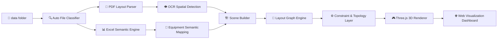
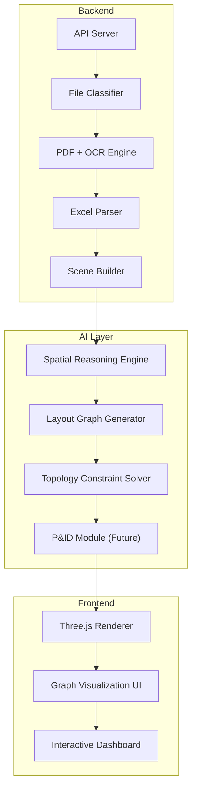

# 🌐 Industrial Digital Twin System  
# 工业数字孪生系统

==================================================

## 📌 One-line Overview

将工业二维图纸（PDF/PNG）+ Excel设备数据  
自动转换为可交互3D工业数字孪生系统（AI驱动）。

---

# 🧠 Industrial AI · Spatial Computing · Graph Engineering System

==================================================

## 🧭 System Pipeline / 工业数据流（Mermaid）



==================================================

## 🏗 System Architecture / 系统架构（Mermaid）



==================================================

## 📡 API Overview（UI卡片风格）

```text
┌────────────────────────────────────┐
│ GET /api/pipeline                  │
├────────────────────────────────────┤
│ Full digital twin output           │
│ Scene + Graph + Constraints        │
└────────────────────────────────────┘
```

```text
┌────────────────────────────────────┐
│ GET /api/layout_graph              │
├────────────────────────────────────┤
│ Semantic graph (nodes/edges/zones)│
└────────────────────────────────────┘
```

```text
┌────────────────────────────────────┐
│ POST /api/upload                   │
├────────────────────────────────────┤
│ Upload PDF/Excel → Auto pipeline   │
└────────────────────────────────────┘
```

==================================================

## 🚀 GitHub Banner（封面强化）

```text
███████████████████████████████████
INDUSTRIAL DIGITAL TWIN SYSTEM
███████████████████████████████████

✔ Auto Layout Understanding
✔ OCR Spatial Intelligence
✔ Semantic Graph Engine
✔ 3D Industrial Reconstruction
```

---

## ✅ Current System Features / 当前系统能力

### 1️⃣ 智能文件识别系统（Zero naming dependency）

🇨🇳  
用户只需将文件放入：

`data/`

系统自动识别：

- layout（二维图纸）
- excel（设备清单）
- reference（技术参考）
- gad（标准图纸）
- structure（结构图）

✔ 无需改名  
✔ 支持中文/英文/法语文件名  
✔ 自动分类

---

### 2️⃣ PDF 图纸解析系统

✔ PDF → 图像转换  
✔ 多页拆分  
✔ 自动选择第一页作为布局图  
✔ runtime缓存机制

---

### 3️⃣ OCR设备定位系统

自动识别设备 Tag：

- B200
- E100
- P001A

输出：

- 坐标 `position`
- 置信度 `confidence`
- 来源 `source`（ocr / pickpoint / fallback）

---

### 4️⃣ Excel设备语义融合系统

解析：

- tag
- service
- diameter
- length
- height
- position

✔ 设备属性绑定  
✔ 工艺分类支持（pump / tank / exchanger）

---

### 5️⃣ Layout Graph（核心创新）

系统输出结构化工业语义图：

```json
{
  "nodes": [],
  "edges": [],
  "zones": [],
  "constraints": [],
  "walls": {}
}
```

---

## 🏗️ System Architecture / 系统架构

```
data/
  ├─ (任意命名的 PDF / PNG / JPG / XLSX)
  ↓
file_classifier
  ↓
pdf_loader (if PDF layout)
  ↓
locator (OCR + fallback)
  ↓
excel parser (semantic binding)
  ↓
walls parser
  ↓
relations engine
  ↓
layout_graph builder
  ↓
API output + Three.js rendering
```

---

## 📁 Data Folder Policy / 数据目录规则

用户可自由命名并放入以下类型文件：

- 工业布局图：PDF / PNG / JPG / JPEG
- 设备表：XLSX
- 技术参考：PDF
- GAD Typical：PDF
- 结构图：PDF / PNG / JPG / JPEG

系统会自动分类，必要时写入：

- `data/runtime/`

---

## 🚀 Quick Start / 快速启动（统一 python3）

### 1) 安装依赖

```bash
python3 -m pip install -r requirements.txt
```

### 2) 启动后端（5000）

```bash
python3 -m backend.api
```

### 3) 启动前端（3000）

```bash
cd frontend
python3 -m http.server 3000
```

### 4) 打开浏览器

- `http://localhost:3000`

---

## 🧭 End-to-End Flow / 全链路流程

1. 把文件放进 `data/`（任意命名）
2. 启动后端和前端
3. 打开网页并点击「加载项目」
4. 系统自动执行：
   - 文件识别
   - PDF转图
   - OCR定位
   - Excel语义融合
   - 墙体/房间解析
   - 空间关系计算
   - Layout Graph生成
   - Three.js实时更新

---

## 🌐 API Overview / API接口总览

### 基础接口

- `GET /api/files`  
  当前自动识别到的文件分类结果

- `GET /api/status`  
  文件完整性状态（ready / missing）

- `POST /api/upload`  
  上传新文件并触发自动重算

### 语义与场景接口

- `GET /api/scene`  
  3D场景设备数据

- `GET /api/walls`  
  墙体/房间/中心点

- `GET /api/relations`  
  空间关系（距离/左右/靠墙/平行等）

- `GET /api/layout_graph`  
  语义图结构（nodes / edges / zones / constraints）

- `GET /api/pipeline`  
  统一总输出（scene + relations + walls + layout_graph）

---

## 🧩 API Response Cards / API响应示例卡片

### `GET /api/pipeline`

```json
{
  "scene": [
    {
      "tag": "B200",
      "service": "Reactor / Settler",
      "position_mm": [8210.4, 12250.2],
      "dimensions": { "diameter": 5300, "length": null, "height": 14200 },
      "confidence": 0.93
    }
  ],
  "relations": {
    "B200_left_of_P001A": true,
    "distance_B200_P001A": 3.2
  },
  "walls": {
    "walls": [],
    "rooms": [],
    "center": [8750.0, 8750.0]
  },
  "layout_graph": {
    "nodes": [],
    "edges": [],
    "zones": [],
    "constraints": []
  }
}
```

### `GET /api/layout_graph`

```json
{
  "nodes": [
    {
      "id": "B200",
      "type": "tank",
      "service_system": "reactor_settler",
      "process_role": "storage_reaction",
      "zone": "Z1",
      "position_mm": [8210.4, 12250.2],
      "confidence": 0.93
    }
  ],
  "edges": [
    { "source": "B200", "target": "P001A", "type": "left_of", "weight": 1.0 },
    { "source": "B200", "target": "P001A", "type": "connected_process", "weight": 0.8 }
  ],
  "zones": [
    { "zone_id": "Z1", "type": "process_unit", "devices": ["B200", "P001A"], "center": [8200, 12100] }
  ],
  "constraints": [
    { "type": "zone_capacity", "zone_id": "Z1", "max_devices": 12 }
  ],
  "walls": {
    "walls": [],
    "rooms": [],
    "center": [8750.0, 8750.0]
  }
}
```

---

## 🖥️ Frontend UI / 前端展示能力

目前前端支持：

- 数据上传面板（图纸 + Excel + 参考PDF + GAD）
- Three.js 实时渲染（非写死坐标）
- 设备 tag 显示
- 设备点击查看属性
- Zone/Edge 图语义可视化
- 右侧信息面板（设备语义信息）

---

## 🧪 Industrial Notes / 工业使用说明

- 坐标原则：图纸优先，Excel只做属性补全
- 文件原则：零命名依赖
- 算法原则：支持反复更换文件后自动重算
- 兼容原则：无 GUI 服务器环境下，OCR失败会返回结构化错误信息

---

## 🛣️ Roadmap / 路线图

### Phase A（已完成）

- 自动文件分类
- PDF转图
- OCR定位 + fallback
- Excel属性融合
- 墙体/房间解析
- 关系引擎
- Layout Graph基础结构

### Phase B（进行中）

- OCR稳定性增强（缓存 + 多模型投票）
- Zone语义细分（process_unit / utility / storage / corridor）
- 关系边置信度评分
- 更强工艺流推理（upstream/downstream）

### Phase C（规划中）

- P&ID 联动
- 设备拓扑约束优化
- 多工厂版本管理
- 部署级 observability（metrics / tracing / audit）

---

## 🤝 Contribution / 贡献建议

- 欢迎提交 PR：算法增强、识别稳定性、前端工业可视化增强
- 建议包含：输入样例、期望输出、失败案例

---

## 📜 License

以仓库中的 LICENSE 文件为准（如未提供则按项目后续补充）。

---

## 八、运行限制说明（真实工程情况）

🇨🇳  
在当前 headless（无GUI）环境中：

- OCR 可能出现识别不完整
- pickpoint 人工采点功能不可弹窗使用

系统设计为：

✔ 自动 fallback（回退机制）  
✔ 不崩溃  
✔ 返回结构化错误或缓存结果

---

🇫🇷  
Dans un environnement headless :

- L’OCR peut être partiellement limité
- Le module pickpoint (clic manuel) ne peut pas s’afficher

Le système :

✔ utilise un fallback automatique  
✔ ne plante jamais  
✔ renvoie des résultats structurés ou mis en cache

---

## 九、下一阶段路线图（Roadmap）

🚀 **Stability / 稳定性增强**

- `positions_cache.json` fallback（OCR失败回退机制）
- confidence-weighted edges（关系置信度加权）

---

🧠 **Semantic Upgrade / 语义增强**

Zone 分类系统：

- pipe_rack（管廊区域）
- storage（存储区）
- maintenance_corridor（维护通道）
- process_unit（工艺单元）

---

🎨 **Frontend Upgrade / 前端增强**

- layer toggle system（图层开关系统）
- zones / edges / labels / walls 可视化
- mini map（小地图导航）
- camera presets（视角预设）

---

🏭 **Industrial Expansion / 工业级扩展**

未来支持：

- AutoCAD DXF import
- CATIA STEP / IGES support
- Blender 自动建模
- AI 工艺流推理（process reasoning）

---

## 十、项目价值（定位升级）

🇨🇳  
本项目是：  
**工业图纸理解系统 + 数字孪生底层引擎 + 语义建模框架**

---

🇫🇷  
Ce projet est :  
**un moteur de compréhension de plans industriels**  
**et une base de jumeau numérique + modélisation sémantique**

---

## 十一、核心工程原则（必须遵守）

✔ Zero config（零配置运行）  
✔ Auto file detection（自动文件识别）  
✔ Layout Graph first-class architecture（图结构为核心）  
✔ python3 only（统一Python3）  
✔ GitHub-ready formatting（可直接开源展示）  
✔ Industrial-grade clarity（工业级表达清晰度）

---

## 📌 可选增强建议（重要提示）

如果你愿意，我可以下一步再帮你做一个：

👉 **README 封面增强版**

包含：

- 系统流程图（Mermaid升级版）
- 模块架构图（Backend / Frontend / AI pipeline）
- API响应示例卡片 UI化展示
- GitHub主页视觉优化结构

用于更强的开源展示效果。
